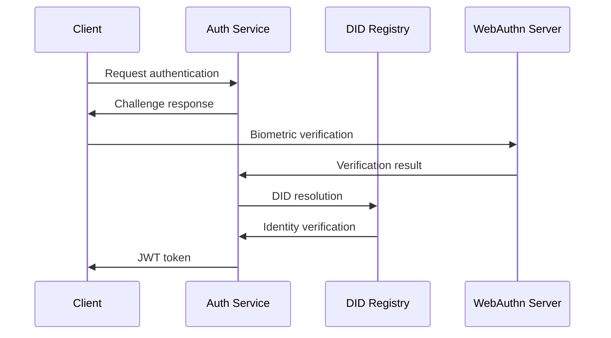
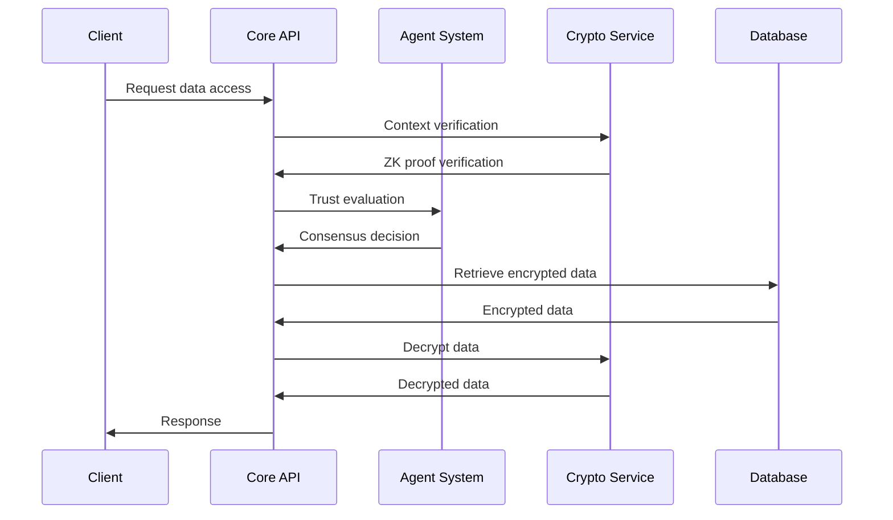

# ReliQuary System Architecture Documentation

## Overview

ReliQuary is an enterprise-grade cryptographic memory vault system that provides context-aware secure data access using AI agents, trust-based consensus, post-quantum encryption, and Zero-Knowledge Proofs. This document details the system architecture, components, and design principles.

## System Architecture

### High-Level Architecture

```
┌─────────────────────────────────────────────────────────────────────┐
│                          Client Applications                        │
├─────────────────────────────────────────────────────────────────────┤
│                        API Gateway & Load Balancer                  │
├─────────────────────────────────────────────────────────────────────┤
│                   │                   │                   │         │
│     Auth        │    Core API       │   Agent System    │  Admin  │
│   Service       │   Services        │                   │ Portal  │
│                   │                   │                   │         │
├─────────────────────────────────────────────────────────────────────┤
│              Data Storage & Cryptographic Layers                  │
├─────────────────────────────────────────────────────────────────────┤
│                    │                    │                    │      │
│   PostgreSQL     │   Redis Cache     │   Object Storage   │  Log   │
│   (Primary)      │   (Session)       │   (Encrypted)      │ Store  │
│                    │                    │                    │      │
└─────────────────────────────────────────────────────────────────────┘
```

### Core Components

#### 1. Authentication Service

- OAuth 2.0 implementation
- JWT token management
- Role-Based Access Control (RBAC)
- Decentralized Identifier (DID) integration
- WebAuthn support for biometric authentication

#### 2. Core API Services

- Data storage and retrieval
- Context verification
- Trust scoring
- Audit logging
- Metrics collection

#### 3. Agent System

- Multi-agent consensus engine
- LangGraph workflow management
- Specialized agent types (Neutral, Permissive, Strict, Watchdog)
- Threshold cryptography coordination

#### 4. Data Storage Layer

- PostgreSQL for structured data
- Redis for session caching
- S3-compatible storage for encrypted objects
- Merkle tree logging for audit trails

#### 5. Cryptographic Layer

- Post-quantum cryptography (Kyber, Falcon)
- Zero-Knowledge Proof system (Circom, SnarkJS)
- AES-GCM encryption for data at rest
- Hardware Security Module (HSM) integration

## Data Flow

### Authentication Flow



### Data Access Flow



## Security Architecture

### Cryptographic Design

#### Post-Quantum Cryptography

- **Kyber**: Lattice-based key encapsulation for secure key exchange
- **Falcon**: Lattice-based digital signatures for authentication
- Implementation in Rust for performance and security

#### Zero-Knowledge Proofs

- **Circom**: Domain-specific language for creating ZK circuits
- **SnarkJS**: JavaScript library for proof generation and verification
- Custom circuits for device, location, and timestamp verification

#### Data Encryption

- **AES-GCM**: Symmetric encryption for data at rest
- **Key Management**: Hardware Security Modules (HSM) for key storage
- **Envelope Encryption**: Data encryption keys protected by master keys

### Trust Model

#### Multi-Agent Consensus

- Byzantine Fault-Tolerant algorithms
- Specialized agent types with different trust profiles
- LangGraph for complex workflow management
- Threshold cryptography for secret sharing

#### Dynamic Trust Scoring

- Machine learning models for behavior analysis
- Real-time risk assessment
- Adaptive security thresholds
- Anomaly detection algorithms

## Scalability Architecture

### Microservices Design

- Independent deployment of services
- API Gateway for request routing
- Load balancing for high availability
- Circuit breakers for fault tolerance

### Database Scaling

- Read replicas for query distribution
- Sharding for horizontal scaling
- Connection pooling for efficiency
- Caching layers for performance

### Agent System Scaling

- Horizontal scaling of agent nodes
- Load distribution across agent types
- State management with LangGraph
- Message queuing for asynchronous processing

## Deployment Architecture

### Containerization

- Docker images for all services
- Multi-architecture support (AMD64, ARM64, ARM/v7)
- Kubernetes manifests for orchestration
- Helm charts for easy deployment

### Cloud Deployment

- AWS, Azure, and Google Cloud Platform support
- Infrastructure as Code with Terraform
- Auto-scaling groups for dynamic capacity
- Multi-region deployment for disaster recovery

### Hybrid Deployment

- On-premises installation options
- Air-gapped environment support
- Self-hosting installation scripts
- Configuration management tools

## API Architecture

### RESTful Design

- Resource-based URL structure
- Standard HTTP methods
- JSON request/response format
- Comprehensive error handling

### GraphQL Support

- Flexible query language for complex data retrieval
- Real-time subscriptions for event-driven updates
- Schema introspection for documentation
- Type safety with strong typing

### WebSocket Integration

- Real-time communication for agent coordination
- Event streaming for audit logs
- Bidirectional messaging for interactive features
- Connection management and reconnection logic

## Monitoring and Observability

### Metrics Collection

- Prometheus for time-series metrics
- Grafana for visualization dashboards
- Custom metrics for business KPIs
- Health checks for service status

### Logging

- Structured logging with JSON format
- Log aggregation with ELK stack
- Audit trails with Merkle trees
- Log retention and archiving policies

### Tracing

- Distributed tracing with OpenTelemetry
- Service mesh integration
- Performance profiling
- Bottleneck identification

## Compliance Architecture

### Data Protection

- GDPR compliance framework
- Data encryption at rest and in transit
- Right to erasure implementation
- Data portability features

### Audit Trails

- Immutable logging with Merkle trees
- Comprehensive activity tracking
- Compliance reporting tools
- Audit log retention policies

### Access Controls

- Role-Based Access Control (RBAC)
- Attribute-Based Access Control (ABAC)
- Just-in-time access provisioning
- Access review and certification

## Integration Architecture

### SDK Ecosystem

- Python, JavaScript, Java, and Go SDKs
- Comprehensive documentation and examples
- Automated testing and quality assurance
- Semantic versioning and release management

### Third-Party Integrations

- Identity providers (OAuth, SAML)
- Cloud storage services (S3, Azure Blob, GCS)
- Monitoring platforms (Datadog, New Relic)
- Communication tools (Slack, Discord, Email)

## Performance Architecture

### Caching Strategy

- Multi-level caching (L1, L2, L3)
- Cache invalidation policies
- Cache warming for predictable loads
- CDN integration for static assets

### Database Optimization

- Index optimization for query performance
- Query optimization and execution plans
- Connection pooling for efficiency
- Read replicas for scalability

### Network Optimization

- Content delivery networks (CDNs)
- HTTP/2 and HTTP/3 support
- Compression for data transfer
- Connection pooling for external services

## Disaster Recovery

### Backup Strategy

- Automated backups with versioning
- Cross-region replication
- Point-in-time recovery
- Backup validation and testing

### High Availability

- Multi-zone deployment
- Load balancing and failover
- Health checks and auto-healing
- Redundancy at all layers

### Business Continuity

- Disaster recovery plans
- RTO and RPO targets
- Incident response procedures
- Communication protocols

## Future Architecture Enhancements

### Quantum-Resistant Enhancements

- Advanced lattice-based cryptographic schemes
- Quantum key distribution integration
- Post-quantum certificate authorities
- Quantum-safe communication protocols

### AI/ML Integration

- Enhanced behavioral analysis models
- Predictive threat detection
- Automated security response
- Intelligent resource allocation

### Edge Computing

- Edge deployment options
- Federated learning capabilities
- Offline operation support
- Synchronization protocols

## Conclusion

The ReliQuary architecture is designed for security, scalability, and enterprise readiness. The system combines cutting-edge cryptographic techniques with advanced AI/ML capabilities to provide a robust platform for secure data management. The modular design allows for flexible deployment options while maintaining high security standards and compliance requirements.
