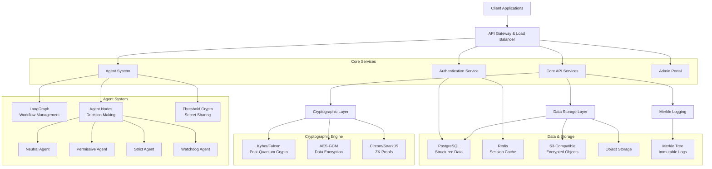
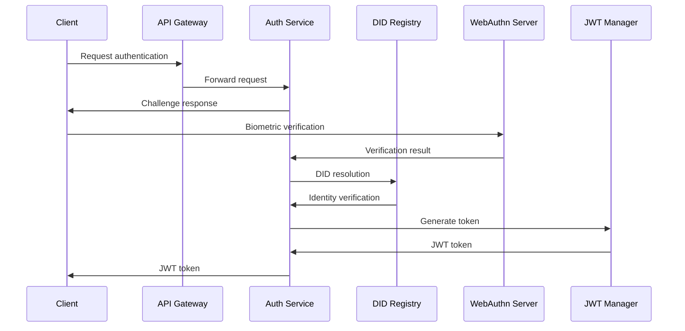
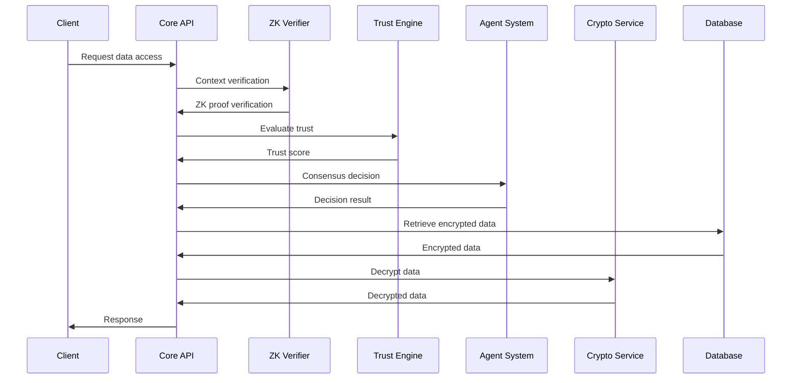
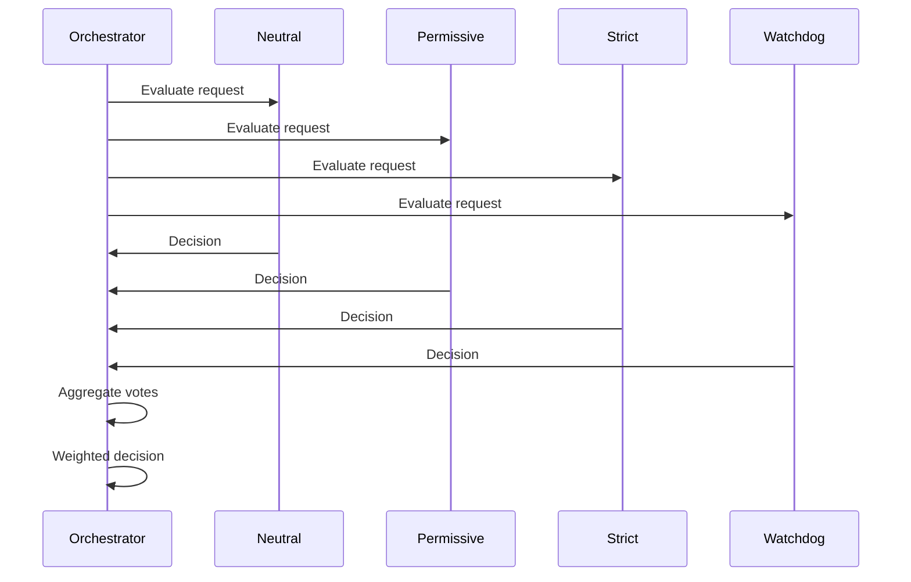
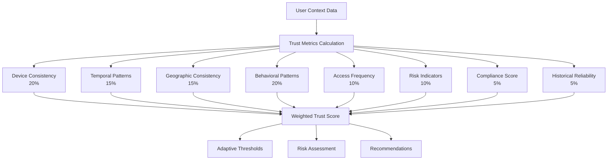
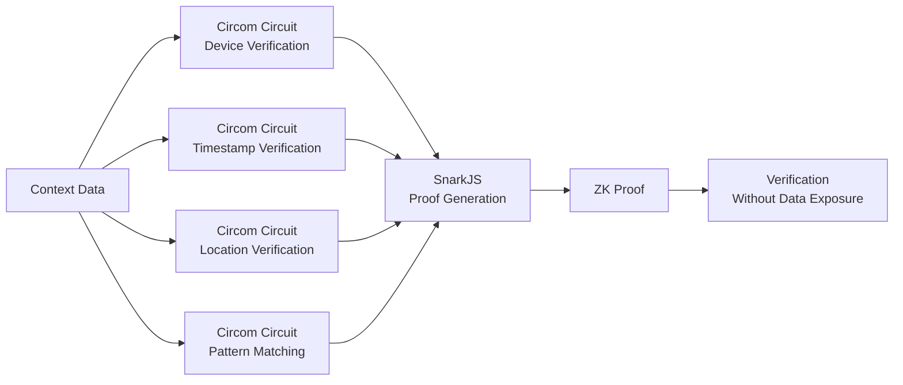
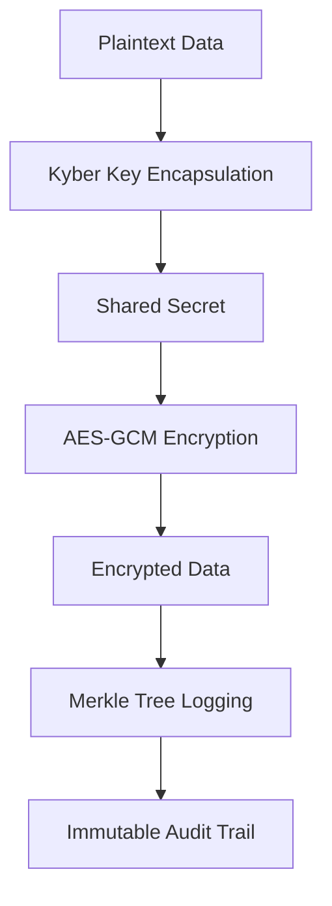
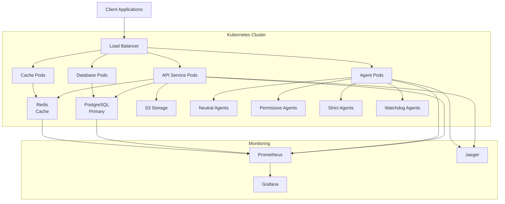
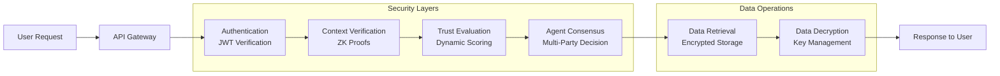

# ReliQuary System Architecture and Flow Diagrams

## 1. High-Level System Architecture



## 2. Authentication Flow



## 3. Data Access Flow



## 4. Multi-Agent Consensus Flow



## 5. Trust Scoring Engine



## 6. Zero-Knowledge Proof Workflow



## 7. Post-Quantum Cryptography Pipeline



## 8. System Deployment Architecture



## 9. Data Flow Through the System



## 10. API Endpoints Overview

```mermaid
graph TB
    A[ReliQuary API v2.0.0] --> B[Health Endpoints]
    A --> C[Authentication Endpoints]
    A --> D[Vault Management]
    A --> E[Context Verification]
    A --> F[Trust Scoring]
    A --> G[Agent Orchestration]
    A --> H[Audit Logging]
    A --> I[Zero-Knowledge Proofs]

    B --> B1[/health]
    B --> B2[/health/detailed]

    C --> C1[/auth/health]
    C --> C2[/auth/info]
    C --> C3[/auth/login]
    C --> C4[/auth/register]

    D --> D1[/vaults]
    D --> D2[/vaults/{id}]
    D --> D3[/vaults/{id}/secrets]

    E --> E1[/context/verify]
    E --> E2[/context/history]

    F --> F1[/trust/score]
    F --> F2[/trust/history]

    G --> G1[/agents/evaluate]
    G --> G2[/agents/status]

    H --> H1[/logs/summary]
    H --> H2[/logs/entry]

    I --> I1[/zk/verify]
    I --> I2[/zk/generate]
```
